# zkvault v1.0.0

*3 September 2026*

The first complete release: a local-first, zero-knowledge password manager with
a working CLI, a blind sync server, and a documented vault format. Your vault is
encrypted on your device with a key derived from a passphrase that never leaves
it. The server stores a blob it cannot read, search, or recover.

**Status:** the CLI and the sync server are implemented and tested. The Kotlin
Multiplatform client is a reviewed skeleton, not yet compiled. Nothing here has
had an external security review — read
[NEXT_STEPS.md](NEXT_STEPS.md) before trusting it with real credentials.

---

## Creating a vault

`zkvault init` picks Argon2id parameters, measures what they cost on your
machine, and says the quiet part out loud before you commit to a passphrase.

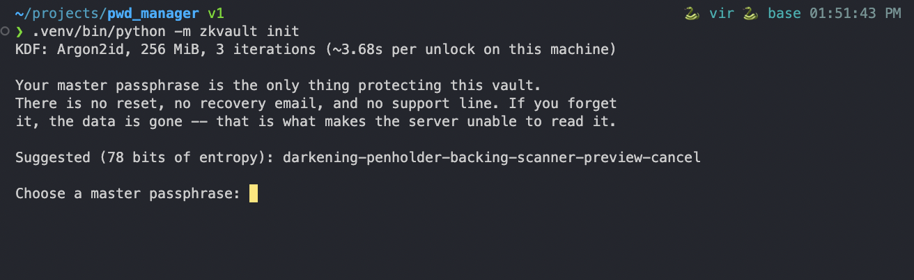

Argon2id at 256 MiB and 3 iterations is roughly 3.6 s per unlock on this
machine — deliberately slow, because that cost is what an offline attacker pays
per guess. The suggested passphrase is drawn from the EFF long wordlist at 78
bits of entropy; you can take it or type your own.

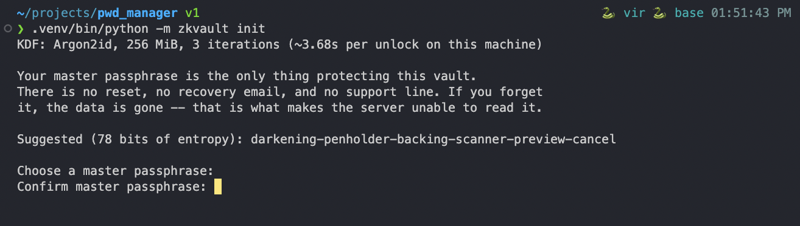

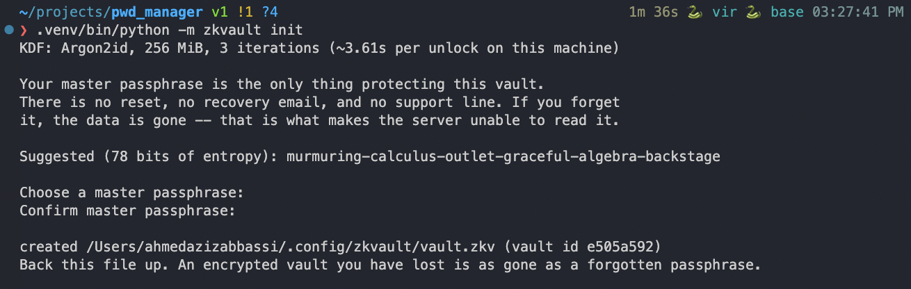

Short passphrases are refused rather than warned about. `--force` exists, and
you have to reach for it.

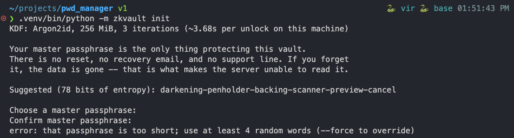

## Everyday use

Entries are added with a generated password by default. Generation uses the
system CSPRNG and guarantees every requested character class is present.

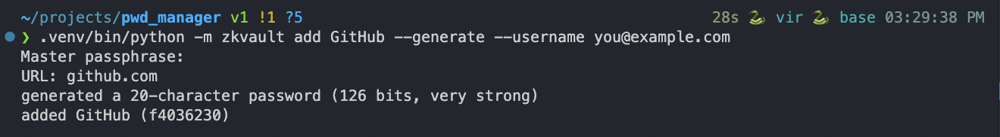

`list` shows titles, usernames and URLs — all of which were decrypted locally to
produce this line. The server has never seen any of it.

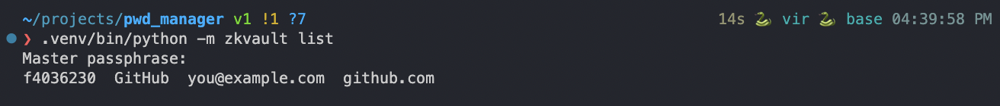

`get` prints the record with the password masked and puts the real value on the
clipboard with a 15-second timer, so a password does not sit in your paste
buffer for the rest of the day.

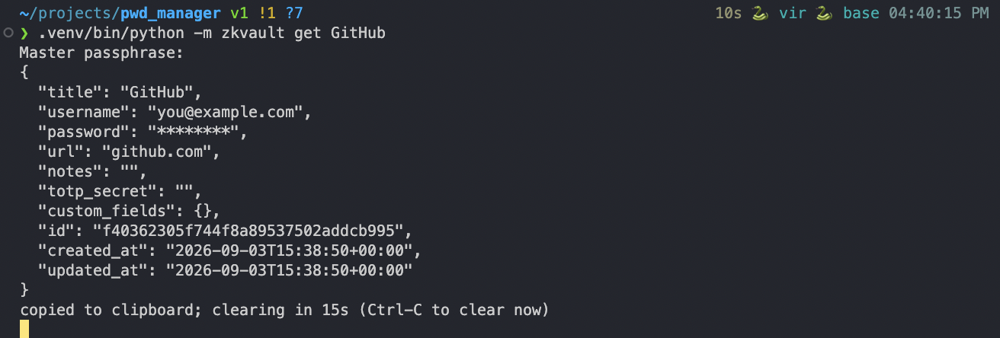

`unlock` opens an interactive session so you pay the Argon2id cost once instead
of per command. It auto-locks after 300 s of inactivity.

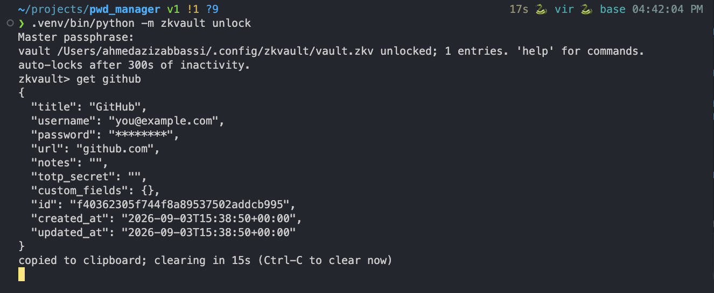

Exiting clears the clipboard and locks the vault.

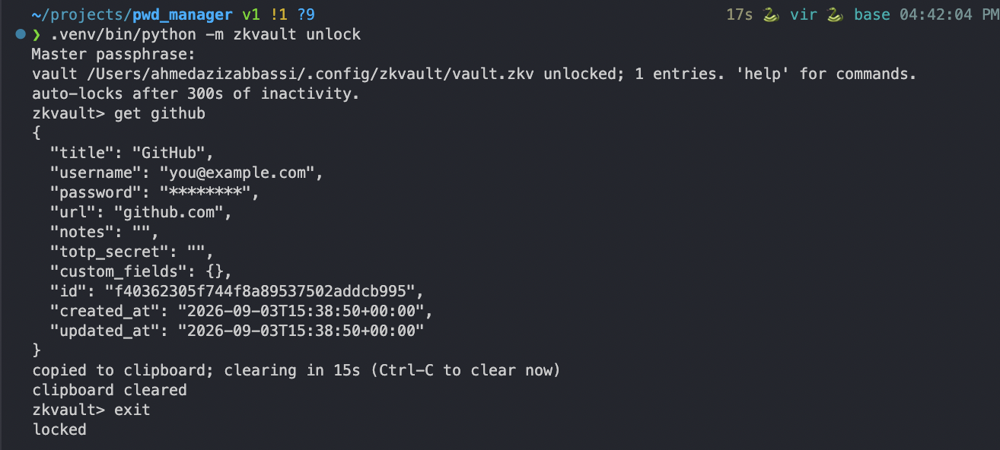

**Also in this release:** `passwd` (change the passphrase; rewraps 48 bytes and
leaves the payload untouched), `rotate-key` (draw a new vault key and
re-encrypt), `gen` (standalone Diceware), `benchmark` (time Argon2id here),
`export` / `import`, and `lock`.

## Blind sync

Point the client at a server and give it an email address. Nothing has been
sent yet.

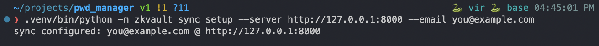

Registration sends a *derived* secret — `BLAKE2b(Argon2id(passphrase, salt))` —
plus the public KDF salt. Not the passphrase, and not anything that can produce
the vault key.

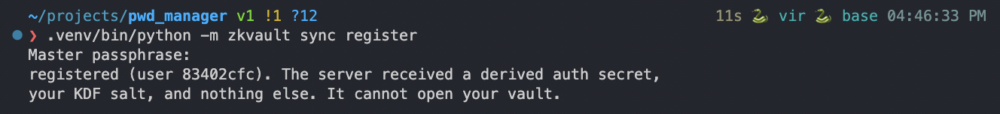

`push` uploads ciphertext under optimistic concurrency: the write carries the
version it was based on, and a stale base is a 409 with the server's version
rather than a silent overwrite of an entry added on another device.

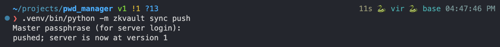

`sync audit` shows your own login history, because an unexplained login is
exactly what a victim needs to see early. Note the `login.failed` — that was a
wrong passphrase, recorded without anything derived from the request body.

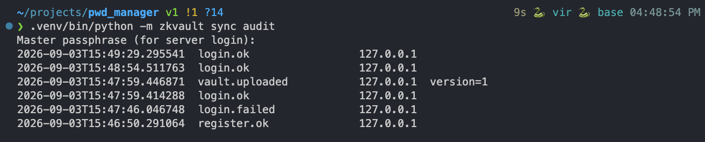

## The server's view

The same activity from the other side. Access logs carry method, path, status
and latency, and a correlation id — never a body, never a query string. Vault
ciphertext and auth secrets both travel in request bodies, so logging them would
undo the whole design.

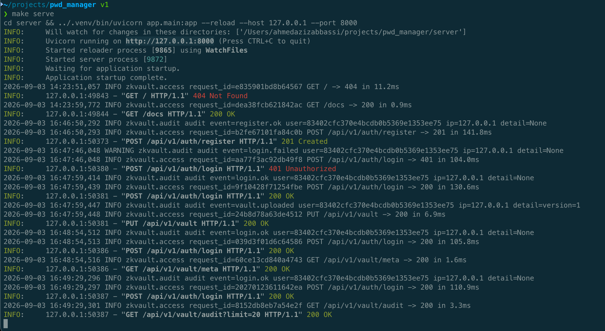

**What the server can see:** email address, KDF salt and parameters, bucketed
blob size, sync times, IP and user agent, and a day-precision modification date.

**What it cannot:** entry count, titles, usernames, URLs, passwords, notes, TOTP
seeds, or per-entry timestamps. The whole vault is encrypted, not just the
password fields — titles and URLs are exactly the metadata that profiles a
person — and ciphertext is Padmé-padded so blob size does not track entry count.

## Server API and documentation

The sync service is FastAPI, versioned under `/api/v1`, and now ships an
annotated OpenAPI schema for development:

| URL | What |
|---|---|
| `/docs` | Swagger UI — register, log in, **Authorize**, and drive the API by hand |
| `/redoc` | The same schema, laid out for reading |
| `/openapi.json` | The raw schema, for client generators |

Every route carries a summary and documents the failures a client actually has
to handle — `401`, `409`, `413`, `429` — rather than only its happy path. `make
openapi` writes the schema to `docs/openapi.json` without a server running.

All three URLs are switched off when `ZKVAULT_ENVIRONMENT` is `production`,
`prod` or `staging`: a published route map is free reconnaissance against a
service that is otherwise meant to give an attacker nothing.

## Security properties

* **XChaCha20-Poly1305** throughout, with random 192-bit nonces — chosen over
  AES-GCM specifically because a 24-byte random nonce removes the nonce-reuse
  failure mode that a backup restore or a sync conflict can otherwise cause.
* **Argon2id** (256 MiB, t=3) to derive the master key; separate BLAKE2b domains
  split it into a key-encrypting key and the server auth secret, so the server's
  copy cannot produce the vault's.
* **The server re-hashes** the auth secret with Argon2id at rest, so a database
  dump yields neither the passphrase nor a usable credential.
* **Rotating refresh tokens with reuse detection.** Replaying a spent token
  revokes the entire family; access tokens live 15 minutes and are not
  individually revocable, which is the trade-off that keeps a database read off
  every request.
* **User-enumeration resistance.** `/auth/kdf-params` answers for unknown
  accounts with deterministic decoy parameters, and failed logins are equalised
  in body *and* in wall-clock time.
* **TOTP** guards sync access only. It cannot gate decryption — the vault opens
  offline from the passphrase alone, and pretending otherwise would be theatre.
* **Strict security headers** and refusal (not redirection) of plaintext
  requests in production: a redirect would still have carried the auth secret
  over the wire once.

## Testing

93 tests covering crypto, the vault format, the CLI, the server, and end-to-end
sync — including tamper, fuzz, rollback and conflict cases. `make test`.

## Known limits

* **No recovery. At all.** Forget the passphrase and the vault is gone. A
  recovery path the server can execute is a decryption path the server can
  execute.
* **No external security review or penetration test yet.** Do not store
  credentials you cannot afford to lose.
* **The rate limiter is in-process.** It under-counts behind multiple workers
  and is no defence against a distributed attacker. Move it to a shared store
  before production — see [SECURITY_CHECKLIST.md](SECURITY_CHECKLIST.md).
* **SQLite by default.** Fine for a single-process dev server; move to Postgres
  before real use.
* **The Kotlin Multiplatform client is a skeleton.** The shared crypto contract,
  vault format, canonical JSON and Keystore wrapping are written, and
  cross-implementation vectors are generated from the Python reference and
  checked in — but nothing there has been compiled or run against them yet.
  There is no Gradle wrapper and no UI.

## Upgrading from the v1 prototype

There is no migration path, and that is intentional. The prototype in `legacy/`
bcrypt-*hashed* passwords (so they could never be read back), stored them with
`pickle` (loading a file was code execution), and generated them with
`random.choice` (predictable from a few hundred characters of output). It is
kept for reference and is wired into nothing.
